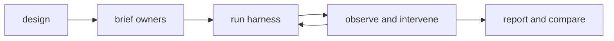

# Novel Benchmark

Coordinate several novel packages as separate experimental units under one shared evidence and review harness. Use `$novel` and `$evidence-graph` inside every work, and read each applicable phase document in full before acting.

## [Design the run](design.md)

Define the common harness, deliberately varied package lineup, package-specific claims, experiment limits, and observations before launching any owner.

## [Brief each owner](brief.md)

For an authoring run, launch one persistent writing subagent per active package and give it exclusive package ownership, creative authority, readings, evidence authority, quality criteria, and completion conditions.

## [Run the harness](run.md)

Advance every package through the same reviewed layer pipeline while preserving upstream ownership, downstream propagation, coordinator state, and literal quality gates.

## [Observe and intervene](observe.md)

Inspect artifacts and compiler state at the requested cadence, distinguish package defects from shared defects, and return each problem to its canonical owner.

## [Report and compare](report.md)

Report evidence-backed progress and compare completed works by process and literary quality without treating speed, size, or citation counts as merit.
