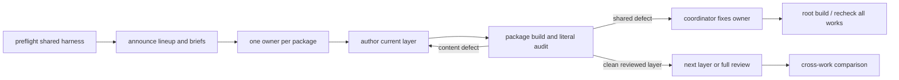

# Novel Benchmark

Use `$novel` and `$evidence-graph` inside every work. Read `AGENTS.md`, the root `README.md`, shared config and principles, and every selected package manifest and lint state before launch.

## Design the run

- Treat one package as one experimental unit. Choose deliberately different genres, research burdens, voices, structures, and audiences.
- Fix the common harness before authorship: skills, principles, graph factory, layer order, stage semantics, compiler gates, output language, review completion, and any scale target. Explicitly define the layer contract: detailed narrative treatment in storylines, production-capable initial script in scenarios, and finished literary prose in manuscripts.
- Announce the lineup before launch. Keep the root README table current with package link, title, subject, genre, experiment axis, and honest status.
- Create new units only with `pnpm create:novel`. Run install and root `build` before agents start. Scaffolding creates structure, not story content.
- Define observations beforehand: elapsed transitions, diagnostics repaired, upstream revisions, stale reviews renewed, literary findings, and clean review rounds. Without a designed control, call the result exploratory rather than causal proof.

## Brief each owner

Give each work one exclusive owner and forbid edits to other packages. The coordinator owns shared config, skills, workspace files, package creation, and cross-work audits.

Every brief states:

- package path, title or seed, genre, intended scale, language, and authorized creative freedom;
- required readings: repository instructions, both writing skills, shared principles, graph factory, and all existing package documents;
- research burden and genre-specific success conditions and failure modes;
- current layer and lint state, exact package `build` command, and completion report fields;
- the phase-specific deliverable: a reader-complete detailed treatment, a stageable initial script, or finished literary prose. Do not let an owner substitute a causal card for a treatment, a beat list for a script, or a script expansion for a novel;
- persistence: routine uncertainty and status are not reasons to stop while useful authorized work remains.

Grant real creative discretion. An owner may decide canon, plot, voice, and ending within the brief and must record canon in settings before relying on it. Escalate only a material choice outside that authority.

## Run the harness

Each owner follows `settings -> storylines -> scenarios -> manuscripts`. All four layers are staged: settings pass their principle-checklist review before storylines begin. Settings are executable canon; storylines are detailed narrative treatments; scenarios are production-capable initial scripts; manuscripts are literary prose. A later discovery fixes the earliest owning layer and propagates through every dependant.

For each authored layer:

1. Keep it `disabled` while completing a full first version. Obvious truthful evidence is allowed; exhaustive coverage is deferred.
2. Change it to `evidence`, clear diagnostics truthfully, and revise content when the graph exposes a real defect.
3. Change it to `review`, reread both ends of every acknowledgement, and complete current fingerprints.
4. Require a clean package build and a literal quality audit before activating the next layer.

Use ordered files and real H2/H3/H4 units. A manuscript H4 is an internal continuous scene boundary, not necessarily a published heading. Do not shrink the promised work merely to finish sooner; negotiate a changed scope explicitly.

Before authorizing scenarios, the coordinator and owner must literally read the full storyline and confirm that its H4s already show reader orientation, active agency, escalating attempts and responses, changed relationships or information, and legible bridges across every deliberate cut. Before authorizing manuscripts, confirm that the scenario can be staged without inventing its essential positions, actions, decisive exchanges, or exit conditions. These are artifact checks, never word-count proxies.

Maintain a coordinator status record outside package `docs` so another agent can resume. Track current phase and unit, lint states, package build, next actions, major decisions, unresolved research, and uncollected setups.

## Observe and intervene

At the user-requested cadence, inspect filesystem output and compiler state rather than trusting self-reports. Send concise progress updates during long runs and a substantive critique at the agreed interval.

Audit samples across every active work:

- settings specificity, factual sourcing, unresolved canon, arithmetic, and downstream usability;
- storyline reader flow, causality, agency, and concrete treatment; scenario executability, physical progression, pivotal dialogue, silence, and blocking; manuscript focal voice, literary effect, rhythm, and emotional consequence;
- H4 continuity of time, place, focal mode, and function;
- truthful lineage, concrete evidence and exclusion reasons, substantive review text, and current fingerprints;
- stage direction, package-only ownership, placeholders, probes, status files, or other repository pollution.

Intervene when an H4 is merely a large partition, a storyline is an event list or causal card, setting detail is inert or still leaves downstream guessing, a scenario hides mechanics in summary or templated beats, a script omits the decisive exchange or physical turn, prose expands field labels, citations are decorative, exclusions use generic layer excuses, reviews say only "checked," or a compiler-green work is dull or incoherent. Do not micromanage sound creative choices, sanitize difficult subject matter, or rank agents by raw counts.

Return package defects to their owner with the observed evidence and required outcome. Fix a genuine shared defect once in its canonical config or skill, run root `build`, and tell every affected owner to recheck. Never weaken the harness for one lagging work.

## Report and compare

Each checkpoint reports a compact table: package, authored layer and state, H2/H3/H4 progress, compiler result, review rounds, and real blocker. Follow it with sampled strengths, interventions already made, and risks still under observation. A number without reading the artifact is not a critique.

At completion, record title and logline, part/chapter/scene counts, manuscript size, lint states, compiler results, review rounds, strongest and weakest qualities, and unfinished scope. Compare process measures without treating speed, heading count, citation count, or exclusion count as literary merit.

Read every completed work literally for canon, causality, agency, execution, voice, pacing, information, emotion, and genre ambition. Separate shared-harness defects, work-specific defects, and benchmark-design limits. A work finishes only with all four layer states at `review`, clean package and root builds, and two consecutive full-work rounds with no finding or content edit.
