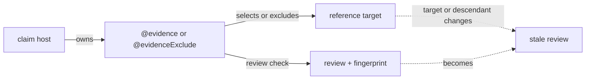

# Evidence Graph

Read `AGENTS.md`, `config/src/createNovelConfig.ts`, the package `lint.config.ts`, and both sides of the evidence edge before editing.

Read the applicable procedure in full:

- [staging.md](staging.md): change `disabled`, `evidence`, or `review`; add evidence to a newly completed layer.
- [review.md](review.md): enter review; write or repair review tags and fingerprints.



Each claim population must account for every unit in every configured reference population. Principle checklists are claimed by the Markdown file host; settings and cross-layer lineage are claimed by their exact H2, H3, or H4 hosts. A selected host cites only targets it actually uses; omission from another host is not an exclusion. `@evidenceExclude` means that no host in that claim population owes the target, so never cite and exclude the same target within one claim population.

A review verifies an acknowledgement against the current target; its fingerprint becomes stale when the covered target changes.

## Model

- A claim is the population that owes acknowledgement.
- A reference is the population it owes.
- Every claim-reference pair is an independent coverage obligation.
- Lineage references pair every child with one parent and every parent with one child at the same heading level; they allow no exclusion.
- Foundation references allow multiple truthful citations and concrete scope exclusions. An exclusion is population-wide, never per host: a host that simply does not use a target stays silent, and only a target no host in the population owes is excluded — once.
- Checklist references (all principle files) are answered item by item: every file host answers every anchored H2 item with its own citation, a whole-file citation is refused as an aggregate, and one host's answer never discharges another host. Every principle reference refuses exclusions: each item binds wherever its condition applies, the citation asserts that conditional compliance, and a file that cannot honestly assert it is defective rather than excludable.
- Settings and storyline obligations use ordinary coverage: every H2 that materially realizes a role may cite it, so one role may span multiple H2 hosts. When no host in the complete claim population realizes the role, record one concrete population-wide exclusion. Never cite and exclude the same target within one claim population.

Permissive coverage can compile dishonestly. Do not let one host cite everything, use a blanket exclusion, or rely on a sibling's acknowledgement to hide an omission. A reason such as “this host uses this setting,” “this summary follows the constraint,” or a target-name paraphrase is not evidence: name the host event, decision, limit, or changed state that would become false without the target. For a principle item, name what in this file does what the item requires. If no such operation exists in the host, do not cite it there.

Before a foundation batch, map each reference target to either one concrete host operation or one population-wide concrete exclusion. Do not dump a catalog beneath an H2 merely because its sequence is broadly related. A target used only by a later chapter or scene belongs beneath that H3 or H4, not its H2 summary. Stop and revise the narrative layer when accurate coverage would otherwise require generic reasons.

## Configuration

`config/src` implements the shared claim populations, reference populations, roots, and strictness behind `createNovelConfig`. A package `lint.config.ts` supplies its location and four layer states and may append package- or experiment-specific `claims`. A package may start with `claims: []` and grow its own typed claims only when a real work-specific evidence need appears. Additional claims never replace, copy, filter, or weaken the shared graph. Their caller owns roots, stage switches, review requirements, cardinality, exclusions, and the target documents they reference.

Package Markdown populations use `root: "docs"`; shared principles and obligations use `config/docs` as their root. Classify every package-specific target by evidence behavior:

- Put checklist conditions that every selected host answers item by item under `docs/principles`.
- Put roles distributed across a configured host population under `docs/obligations`.
- Point an additional cross-layer relationship at the existing authored settings or narrative artifacts when those artifacts already own the target. If an independent target is neither a checklist nor a distributed role, put it under a descriptive third family named with a plural or collective lower-kebab-case noun under `docs/<family>`; do not hide its semantics in a generic directory such as `contracts` or `misc`.

Name a principle file `common.md`, `narratives.md`, or for its selected layer (`settings.md`, `storylines.md`, `scenarios.md`, or `manuscripts.md`). Name an obligation file for its owning layer with the same layer filename. In a third family, use the owning layer filename when the whole file is layer-scoped; otherwise use a descriptive lower-kebab-case filename. Contract and reference-target filenames take no numeric prefix, and every addressable item is an anchored H2. Keep authored settings and narrative filenames in their existing `001-slug.md` sequence. Create no empty target file or family, and activate every package target only through that package's added claim.

Targets are stable logical addresses such as `settings/...`, `principles/...`, and `obligations/...`, independent of filesystem distance. The novel phase documents own the shared checklist, obligation, and H2/H3/H4 setting and lineage topology.

## Tags

Place file-level principle checklist answers in one HTML comment before the document's first H1: every file answers `principles/common.md` and its own layer's principle file, and each narrative file also answers `principles/narratives.md`, one line per anchored H2 item. Place setting, obligation, lineage, and configured package-claim tags directly below the H2, H3, or H4 they justify unless that claim deliberately selects file hosts:

```text
@evidence path/file.md#anchor Why the host uses or realizes the target.
@evidenceExclude path/file.md#anchor Why the target is outside this host's scope.
@evidenceReview path/file.md#anchor #fingerprint What was checked.
@evidenceExcludeReview path/file.md#anchor #fingerprint What was checked.
```

- The acknowledgement explains the relationship; the review records a separate check.
- In `review`, every acknowledgement — including each principle item answer — carries the fingerprint of its own target, so editing one principle item expires only the answers to that item. The literal literary review still rechecks principle application beyond what any fingerprint proves.
- Write review tags only during `review`.
- Resolve targets inside the configured reference root. Use `settings/...`, `storylines/...`, `scenarios/...`, `manuscripts/...`, shared `principles/...` or `obligations/...`, and any package-local root declared by its claim; do not prefix a target with `docs/`.
- Give every cited Markdown heading a stable `{#anchor}`.

## Diagnostics

Treat each error as a question about evidence, hierarchy, canon, causality, or content. Fix the owning artifact; do not manufacture a tag. A checklist shortfall lists exactly the unanswered items. Every reason must be true, detailed, and specific to the relationship between its host and target, as required by the model above.

Work by complete claim batches with `pnpm --filter <package-name> build`. Before handoff, run root `pnpm build` and `git diff --check`.
