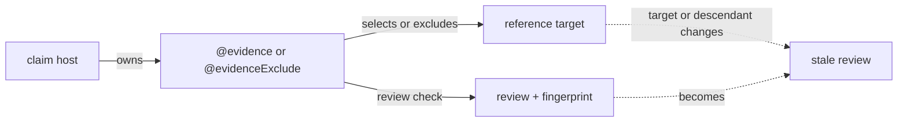

# Evidence Graph

Read `AGENTS.md`, `config/src/createLintConfig.ts`, the package `lint.config.ts`, and both sides of the evidence edge before editing.

Read the applicable procedure in full:

- [staging.md](staging.md): change `disabled`, `evidence`, or `review`; add evidence to a newly completed layer.
- [review.md](review.md): enter review; write or repair review tags and fingerprints.



Each claim population must account for every unit in every configured reference population. Principle checklists are claimed by the Markdown file host; settings and cross-layer lineage are claimed by their exact H2, H3, or H4 hosts. A selected host cites only targets it actually uses; omission from another host is not an exclusion.

A review verifies an acknowledgement against the current target; its fingerprint becomes stale when the covered target changes.

## Model

- A claim is the population that owes acknowledgement.
- A reference is the population it owes.
- Every claim-reference pair is an independent coverage obligation.
- Lineage references require one parent per host and allow no exclusion.
- Foundation references allow multiple truthful citations and concrete scope exclusions. Within one claim population, never cite and exclude the same target.
- Checklist references (all principle files) are answered item by item: every file host answers every anchored H2 item with its own citation or exclusion, a whole-file citation is refused as an aggregate, and one host's answer never discharges another host. `common.md` refuses exclusions entirely; a layer file permits per-item exclusion with a concrete scope reason, and a whole-file `@evidenceExclude` is one reviewed decision that no item applies.

Permissive coverage can compile dishonestly. Do not let one host cite everything, use a blanket exclusion, or rely on a sibling's acknowledgement to hide an omission. A reason such as “this host uses this setting,” “this summary follows the constraint,” or a target-name paraphrase is not evidence: name the host event, decision, limit, or changed state that would become false without the target. For a principle item, name what in this file does what the item requires. If no such operation exists in the host, do not cite it there.

Before a foundation batch, map each reference target to either one concrete host operation or one population-wide concrete exclusion. Do not dump a catalog beneath an H2 merely because its sequence is broadly related. A target used only by a later chapter or scene belongs beneath that H3 or H4, not its H2 summary. Stop and revise the narrative layer when accurate coverage would otherwise require generic reasons.

## Configuration

`config/src/createLintConfig.ts` owns claim populations, reference populations, roots, and strictness. A package `lint.config.ts` supplies only its location and four layer states; never copy or weaken the graph there.

Package Markdown populations use `root: "docs"`; shared principles use `config/docs` as their root. Targets are therefore stable logical addresses such as `settings/...` and `principles/...`, independent of the package's filesystem distance. The novel phase documents own the checklist and H2/H3/H4 setting and lineage topology.

## Tags

Place file-level principle checklist answers in one HTML comment before the document's first H1: settings files answer `principles/settings.md`, and each narrative file answers `principles/common.md` plus its layer's principle file, one line per anchored H2 item. Place setting and lineage tags directly below the H2, H3, or H4 they justify:

```text
@evidence path/file.md#anchor Why the host uses or realizes the target.
@evidenceExclude path/file.md#anchor Why the target is outside this host's scope.
@evidenceReview path/file.md#anchor #fingerprint What was checked.
@evidenceExcludeReview path/file.md#anchor #fingerprint What was checked.
```

- The acknowledgement explains the relationship; the review records a separate check.
- In `review`, every acknowledgement — including each principle item answer — carries the fingerprint of its own target, so editing one principle item expires only the answers to that item. The literal literary review still rechecks principle application beyond what any fingerprint proves.
- Write review tags only during `review`.
- Resolve targets inside the configured reference root. Use `settings/...`, `storylines/...`, `scenarios/...`, `manuscripts/...`, or shared `principles/...`; do not prefix a target with `docs/`.
- Give every cited Markdown heading a stable `{#anchor}`.

## Diagnostics

Treat each error as a question about evidence, hierarchy, canon, causality, or content. Fix the owning artifact; do not manufacture a tag. A checklist shortfall lists exactly the unanswered items; answer or truthfully exclude each one, never with a copied reason.

Work by complete claim batches with `pnpm --filter <package-name> ttsc`. Before handoff, run root `pnpm ttsc` and `git diff --check`.
