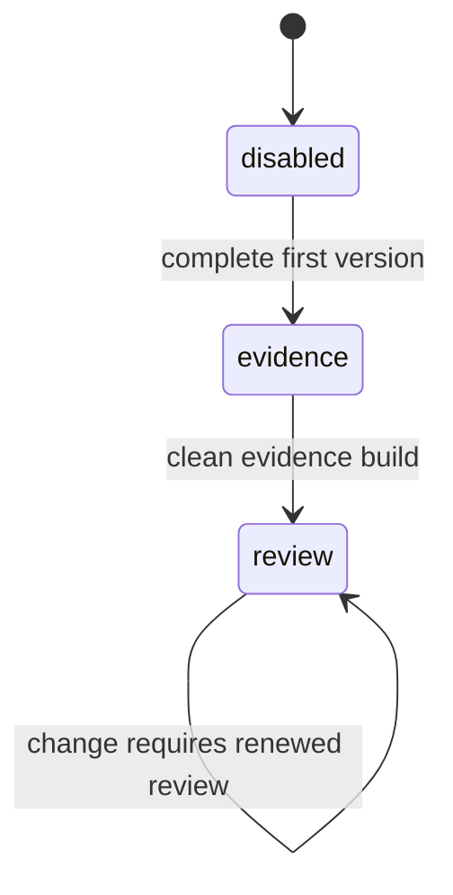

# Evidence Staging

Each package declares one state per authored layer:

```ts
createLintConfig({
  location: __dirname,
  settings: "disabled",
  storylines: "disabled",
  scenarios: "disabled",
  manuscripts: "disabled",
});
```

Advance only in this direction:



- `disabled`: disable the layer's principle checklists and, for the three narrative layers, its H2/H3/H4 setting and lineage claims. Finish the first version without compiler pressure.
- `evidence`: enable claims without `requireReview`. Resolve graph errors and revise content.
- `review`: enable `requireReview`. Independently check and fingerprint every acknowledgement, including each principle item answer.

The state names the active harness, not completed history. Leave a successful layer in `review` so later changes expire its reviews.

`disabled` does not forbid evidence. Record an obvious truthful `@evidence` while drafting, especially when a scenario or manuscript directly refines a reviewed parent. Do not stop the draft to chase complete coverage, exclusions, reviews, or fingerprints; the `evidence` and `review` passes own those jobs.

## Transitions

Move to `evidence` only after the full layer has:

- a complete first version;
- stable H2/H3/H4 structure and ordered filenames (settings: stable anchored H2 facts);
- no placeholders;
- a manual omission pass.

Move to `review` only after the evidence build is clean. Then follow [review.md](review.md); its diagnostics become the worklist.

For a principle checklist pass, reread the whole file against each item before answering it. Answering an item means naming what in this file does what the item requires — or, when the item's condition never triggers in this file, naming that scope fact as the compliance. Do not copy one file's answers into another.

For a settings foundation pass, make a target-to-host map before inserting tags. A citation reason must point to a specific event, decision, resource limit, authority boundary, or irreversible result in the host. Never fill an H2 with a broad catalog of settings or reuse a sentence like “this sequence uses this constraint.” If a target only matters in a child chapter or scene, leave the H2 uncovered and account for it in that child's claim population. If no host in the population uses it, write one concrete population-wide exclusion instead.

Never lower or skip a state. Do not activate a layer before its immediate upstream layer has a clean review build; the pipeline is `settings → storylines → scenarios → manuscripts`.

The `settings` stage owns only the principle checklists on settings files. The settings H2 catalog has no stage of its own: settle it before storylines, revise it when later work exposes a defect, and propagate every consequence; each consuming layer's stage decides whether its settings citations need review.

Keep package comments focused on transition conditions. Do not copy claims into wrappers or create phase-specific configs.

When changing the factory, preserve the typed object API, group claims by layer, and test mixed states.
