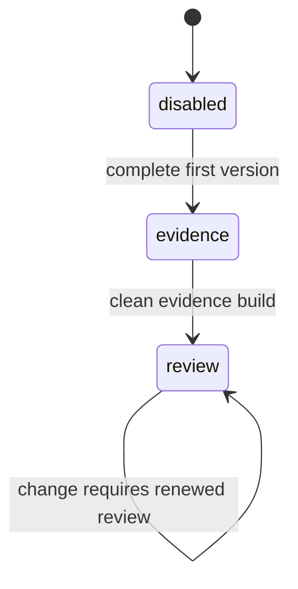

# Evidence Staging

Each package declares one state per authored layer:

```ts
createNovelConfig({
  location: __dirname,
  settings: "disabled",
  storylines: "disabled",
  scenarios: "disabled",
  manuscripts: "disabled",
});
```

Advance only in this direction:



- `disabled`: disable the layer's principle checklists, common unit obligations, any distributed-role obligations, and applicable H2/H3/H4 setting and lineage claims. Finish the first version without compiler pressure.
- `evidence`: enable claims without `requireReview`. Resolve every diagnostic through the [diagnostic procedure](SKILL.md#diagnostics), including structural or full-content reconstruction when required.
- `review`: enable `requireReview`. Independently check and fingerprint every acknowledgement, including each principle item answer.

The state names the active harness, not completed history. Leave a successful layer in `review` so later changes expire its reviews.

`disabled` does not forbid evidence. Record an obvious truthful `@evidence` while drafting, especially when a scenario or manuscript directly refines a reviewed parent. Do not stop the draft to chase complete coverage, exclusions, reviews, or fingerprints; the `evidence` and `review` passes own those jobs.

## Transitions

Move the package-wide layer state to `evidence` only after the full layer — never a partial file batch — has:

- a complete first version;
- stable H2/H3/H4 structure and ordered filenames (settings: stable anchored H2 facts and constraints);
- no placeholders;
- a manual omission pass.

Before changing the state, read every `obligations/common.md` item against every settings H2 or narrative H2/H3/H4. A unit that cannot truthfully answer one stays unacknowledged and keeps the layer in `disabled` while its content is repaired. Commit the complete disabled draft as one coherent snapshot before changing the state; progress commits inside `disabled` do not authorize the transition.

Move the full layer to `review` only after every evidence claim batch is complete and the package build is clean. Commit that complete evidence state before changing the state. A build error is a closed gate: do not start review, activate a downstream layer, or continue unrelated downstream writing while it remains unresolved. Then follow [review.md](review.md); its diagnostics become the worklist.

For a principle checklist pass, reread the whole file against each item before answering it. An item binds every unit in the file, never the file on average: answer from the weakest unit the item governs, not from the passage that demonstrates it best. An item that holds in the opening units and fails in the later ones is failed — repair those units before answering. When the item's condition never triggers anywhere in the file, name that scope fact as the compliance. Do not copy one file's answers into another.

For a settings foundation pass, make a target-to-host map before inserting tags. A citation reason must point to a specific event, decision, resource limit, authority boundary, or irreversible result in the host. Never fill an H2 with a broad catalog of settings or reuse a sentence like “this sequence uses this constraint.” If a target only matters in a child chapter or scene, leave the H2 uncovered and account for it in that child's claim population. If no host in the population uses it, write one concrete population-wide exclusion instead.

Never lower or skip a state. Do not activate a layer before its immediate upstream layer has a clean review build; the pipeline is `settings → storylines → scenarios → manuscripts`.

Every layer state owns its `obligations/common.md` answers and the additional principle, role, foundation, and lineage claims listed in its `$novel` phase document and implemented by `config/src`. Common unit obligations permit no exclusion. The settings H2 catalog has no stage of its own: settle it before storylines, revise it when later work exposes a defect, and propagate every consequence; each consuming layer's stage decides whether its settings citations need review.

Keep package comments focused on transition conditions. Do not copy claims into wrappers or create phase-specific configs.

When changing the factory, preserve the typed object API, group claims by layer, and test mixed states.

## Verification scope

Run the scoped package build at layer-transition and final package gates, not at prose checkpoints. A pure deletion that changes no stage, claim, config, code, or schema is not a layer transition: verify the exact requested targets and inspect the diff, without an unrelated build. Shared instruction or graph changes follow the final repository gate in `AGENTS.md` after their required no-edit reviews.
