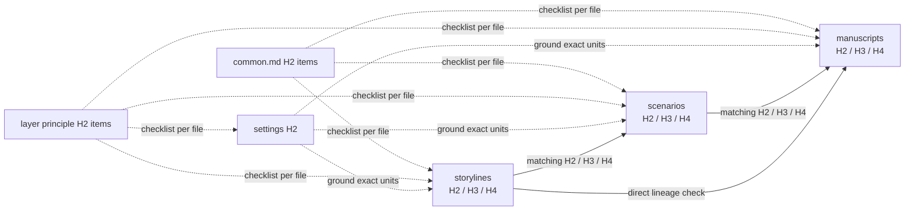

# Novel

Identify the package under `packages/*`. Read `AGENTS.md`, its `package.json`, `lint.config.ts`, every earlier narrative layer, and all `config/docs/principles/*.md`.

Principles are per-layer checklists answered once at file scope: every file answers its layer's principle file, and every narrative file also answers `common.md`. Settings ground the exact H2, H3, and H4 units that use them. Matching H2, H3, and H4 units preserve lineage across layers; Markdown hierarchy already owns same-layer parentage, so do not cite it again.

Apply this workflow without subject-matter exceptions. Historical, biographical, real-world, familiar, or heavily researched material still requires explicit package canon and the full lineage, evidence, staging, and review workflow; external knowledge never substitutes for them.

## [Settings](settings.md)

Research and define detailed canonical facts and constraints. Keep them revisable when later writing exposes a better or necessary choice.

## [Storylines](storylines.md)

Write detailed narrative treatments: the scene-by-scene story, its lived pressure, choices, changes, and the reader-visible bridges that make one unit lead into the next.

## [Scenarios](scenarios.md)

Turn reviewed storylines into production-capable initial scripts: staged action, reaction, speech, silence, movement, and transition detailed enough for a later film, theatre, interactive, or prose adaptation without inventing the scene's essential mechanics.

## [Manuscripts](manuscripts.md)

Write finished literary prose: preserve the scenario's earned action while adding the focal consciousness, language, rhythm, imagery, and emotional texture that make it a novel.

## [Review](review.md)

After evidence review passes, repeat full literary and continuity reviews until consecutive rounds find nothing.

## Evidence

Load `$evidence-graph` for layer states, evidence tags, checklists, fingerprints, and diagnostics.

Fix defects at their earliest owning layer, then propagate and reread every affected descendant. Do not invent major creative decisions without user authorization.
