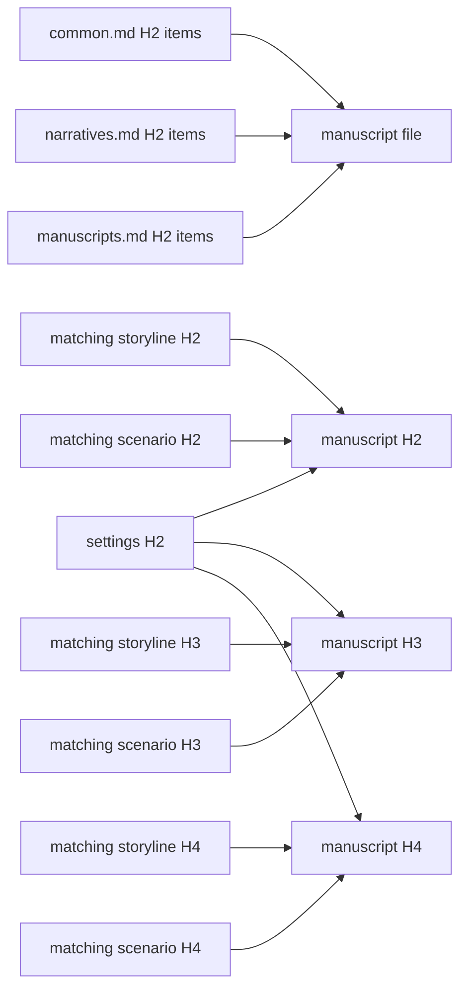

# Manuscripts

Mirror the reviewed scenario's ordered files and H2/H3/H4 units in `docs/manuscripts`.

Write the finished novel. A manuscript preserves the scenario's decisive action, speech, silence, timing, and exit, then transforms them through a chosen consciousness, diction, syntax, rhythm, image, implication, and emotional aftereffect. It is literary prose, not an expanded beat list, a transcript of stage directions, or ornamental language pasted over missing causality.

## H4 boundary

- H4 identifies one continuous scene for authorship, lineage, and evidence.
- It need not appear as a published heading.
- Publication may hide it or render a scene break.
- Do not create a visible mini-chapter only for the graph.

## Craft

This document owns what a manuscript is and how it is produced; `config/docs/principles/common.md` and `narratives.md` own the shared checklists, and `config/docs/principles/manuscripts.md` owns the manuscript checklist. Read all three before drafting and read every scene against their items; do not restate them here. When a manuscript unit adds no perception, voice, or texture the scenario lacked, it has been transcribed rather than written.

## Evidence



This layer answers `principles/common.md`, `principles/narratives.md`, and `principles/manuscripts.md`. Each unit cites the settings it uses and exactly one matching scenario unit and one matching storyline unit at the same level, plus any additional relationship whose package claim selects that unit:

```text
<!--
@evidence scenarios/001-opening.md#scene-id This prose realizes the staged action through the specified focal perception and changed relation.
-->
```

State what the prose actually realizes; relevance alone is insufficient.

`$evidence-graph` owns tag grammar, roots, coverage, and exclusions. Load its [staging](../evidence-graph/staging.md) before changing state and its [review procedure](../evidence-graph/review.md) for fingerprints.

## Harness

Control this layer in the package `lint.config.ts`:

```ts
manuscripts: "disabled",
```

Before leaving `disabled`, read the draft as a reader and reject prose that merely expands scene instructions or loses the script's pressure and consequence.

After the manuscript's clean review build, continue with [review.md](review.md).
