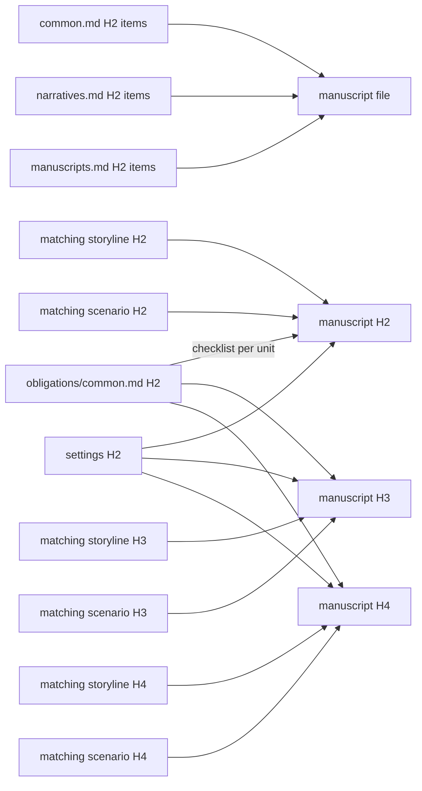

# Manuscripts

Mirror the reviewed scenario's ordered files and H2/H3/H4 units in `docs/manuscripts`.

Write the finished novel. A manuscript preserves the scenario's decisive action or process, timing, exit, and any consequential speech or silence, then transforms them through the work's chosen consciousness or access, diction, syntax, rhythm, image, implication, and emotional or formal aftereffect. It is literary prose, not an expanded beat list, a transcript of stage directions, or ornamental language pasted over a missing narrative connection.

## H4 boundary

- H4 identifies one continuous scene for authorship, lineage, and evidence.
- It need not appear as a published heading.
- Publication may hide it or render a scene break.
- Do not create a visible mini-chapter only for the graph.

Before drafting, inherit the reviewed scenario unit map and preserve each H2/H3/H4 identity. Apply `config/docs/principles/narratives.md#unit-addressability` after drafting; if the prose reveals a hidden independent scene or an artificial split, repair the earliest storyline unit and propagate the corrected one-to-one hierarchy through scenario and manuscript. Do not prepend a treatment-style orientation summary to finished prose.

## Craft

This document owns what a manuscript is and how it is produced; `config/docs/principles/common.md` and `config/docs/principles/narratives.md` own the shared checklists, `config/docs/principles/manuscripts.md` owns the manuscript checklist, and `config/docs/obligations/common.md` owns the common duties every H2/H3/H4 must prove. Read all four before drafting and test every unit and its descendant prose against their items; do not restate them here. When a manuscript unit adds no literary access, voice, or texture the scenario lacked, it has been transcribed rather than written.

## Evidence



This layer answers `principles/common.md`, `principles/narratives.md`, and `principles/manuscripts.md`. Every H2, H3, and H4 directly answers every `obligations/common.md` item and may exclude none. Each unit cites the settings it uses and exactly one matching scenario unit and one matching storyline unit at the same level, plus any additional relationship whose package claim selects that unit:

```text
<!--
@evidence scenarios/001-opening.md#scene-id This prose realizes the staged progression through its chosen access and specified exit effect.
-->
```

State what the prose actually realizes; relevance alone is insufficient.

## Harness

```ts
manuscripts: "disabled",
```

Before leaving `disabled`, read the draft as a reader and reject prose that merely expands scene instructions, loses the script's operative pressure or formal effect, compresses the declared work, or fails a common unit obligation.

After the manuscript's clean review build, continue with [review.md](review.md).
