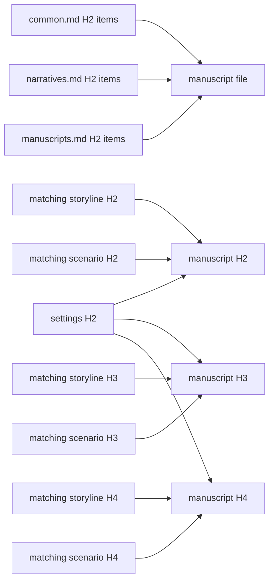

# Manuscripts

Mirror the reviewed scenario's ordered files and H2/H3/H4 units in `docs/manuscripts`.

Write the finished novel. A manuscript preserves the scenario's decisive action, speech, silence, timing, and exit, then transforms them through a chosen consciousness, diction, syntax, rhythm, image, implication, and emotional aftereffect. It is literary prose, not an expanded beat list, a transcript of stage directions, or ornamental language pasted over missing causality.

## H4 boundary

- H4 identifies one continuous scene for authorship, lineage, and evidence.
- It need not appear as a published heading.
- Publication may hide it or render a scene break.
- Do not create a visible mini-chapter only for the graph.

## Craft

This document owns what a manuscript is and how it is produced; `config/docs/principles/manuscripts.md` owns the prose obligations — scene realization from the script, prose control, viewpoint, pacing, reader orientation, dialogue voice, emotional resonance, descriptive function, and tonal contrast. Read it before drafting and read every scene against its items.

## Evidence



Answer the `principles/common.md`, `principles/narratives.md`, and `principles/manuscripts.md` checklists in one HTML comment before the file's first H1. Do not repeat principle tags under H2, H3, or H4.

Place setting and cross-layer lineage acknowledgements directly below the H2, H3, or H4 they justify:

```text
<!--
@evidence scenarios/001-opening.md#scene-id This prose realizes the staged action through the specified focal perception and changed relation.
-->
```

- H2 cites the matching scenario H2 and storyline H2.
- H3 cites the matching scenario H3 and matching storyline H3.
- H4 cites the matching scenario H4 and matching storyline H4.
- Every unit also cites applicable settings or gives a concrete `@evidenceExclude` reason.

Markdown hierarchy already determines each manuscript H3's H2 parent and each H4's H3 parent. Do not duplicate that same-layer parentage with evidence tags.

Targets are relative to their configured reference root. Use `settings/...`, `storylines/...`, `scenarios/...`, or `principles/...` without a `docs/` prefix. State what the prose actually realizes; relevance alone is insufficient.

Load `$evidence-graph` [staging](../evidence-graph/staging.md) before changing state. Its main skill owns tag grammar, checklist policy, roots, coverage, and exclusions; follow its [review procedure](../evidence-graph/review.md) only in `review`.

## Harness

Control this layer in the package `lint.config.ts`:

```ts
manuscripts: "disabled",
```

1. Start only after the matching scenario has a clean review build.
2. Keep `disabled` while writing the complete manuscript without compiler pressure.
3. Read it as a reader and reject prose that merely expands scene instructions or loses the script's pressure and consequence.
4. Change to `evidence`; repair graph and prose defects.
5. Change to `review` only after the evidence build is clean.
6. After the clean review build, continue with [review.md](review.md).
