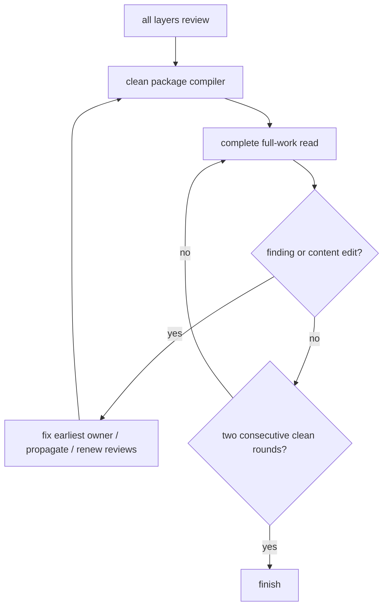

# Full Novel Review

Start when all four layers have clean `review` builds.

Open the package `lint.config.ts` and require this exact state:

```ts
settings: "review",
storylines: "review",
scenarios: "review",
manuscripts: "review",
```

Do not start while any layer is `disabled` or `evidence`. Run the package compiler and require a clean result before the first round.

`requireReview` proves recorded relationships were checked. It does not prove completeness, interest, or literary quality.



## Each round

1. Build a fresh sorted manifest of settings, storylines, scenarios, manuscripts, shared principles and obligations, and every package-local evidence document selected by `lint.config.ts`.
2. Read every file completely in that order.
3. Keep findings until the full read ends; do not stop to edit.
4. Fix every finding at its earliest owning layer.
5. Propagate all consequences and renew affected evidence reviews.
6. Restore package and root gates.
7. Start the next round from a fresh manifest.

Searches, diffs, compiler output, summaries, and earlier partial readings do not replace the full read.

## Lenses

- canon, chronology, geography, arithmetic, resources, and knowledge;
- causality, agency, stakes, reversals, setup, payoff, and aftermath;
- information preserved or lost across all layers;
- scene boundaries, viewpoint, pacing, repetition, and transitions;
- dialogue action, prose rhythm, cliché, exposition, and earned emotion;
- predictability, forced symmetry, checklist writing, and authorial habits;
- source quality and unsupported precision.

A fingerprinted principle answer is a record, not proof of quality: reread each file against the principles as literature, not as a tag audit.

Any content edit invalidates that round as a clean round. Finish only after two consecutive complete rounds find nothing and make no content edit.

Keep the compiler green throughout. It never substitutes for a dry literary round.
