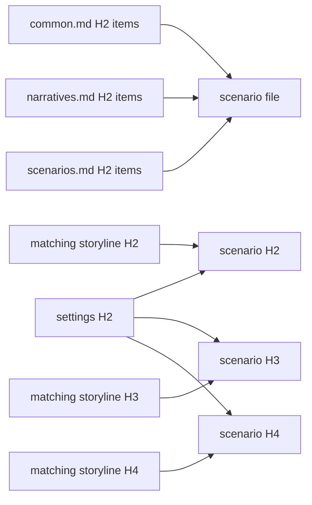

# Scenarios

Mirror the reviewed storyline's ordered files, slugs, H2 sequences, H3 chapters, and H4 scenes in `docs/scenarios`.

Scenarios are **production-capable initial scripts**. They are neither causal summaries nor rigid Hollywood shooting scripts. Use a readable hybrid of short descriptive action blocks, selectively numbered changes, and dialogue blocks. The result must be detailed enough that a director, stage maker, game writer, or novelist can adapt it without inventing the scene's essential order, confrontation, or exit.

## Craft

This document owns what an initial script is and how it is produced; `config/docs/principles/common.md` and `narratives.md` own the shared narrative obligations, and `config/docs/principles/scenarios.md` owns the scene obligations — entry and exit, physical progression, decisive dialogue, the information ledger, and the stageability test that decides whether a draft is still a storyline. Read all three before drafting and test every H4 against their items. When a scenario unit reads no more concretely than the storyline unit it refines, it has been restated rather than staged: find the positions, objects, exchanges, and timings the storyline left to this layer.

## Evidence



This layer answers `principles/common.md`, `principles/narratives.md`, and `principles/scenarios.md`. Each unit cites the settings it uses and its matching storyline unit at the same level:

```text
<!--
@evidence storylines/001-opening.md#scene-id This script realizes the inherited scene through its actual confrontation, movement, and changed exit condition.
-->
```

Write the reason with the actual inherited fact, causal duty, or execution choice.

`$evidence-graph` owns tag grammar, roots, coverage, and exclusions. Load its [staging](../evidence-graph/staging.md) before changing state and its [review procedure](../evidence-graph/review.md) for fingerprints.

## Harness

Control this layer in the package `lint.config.ts`:

```ts
scenarios: "disabled",
```

Before leaving `disabled`, enact every H4 in order: test physical possibility, knowledge, motive, timing, resources, speech, silence, staging, and earned cuts.

When detail exposes a setting or storyline defect, fix the earliest layer and reread the full path back to the scene.
