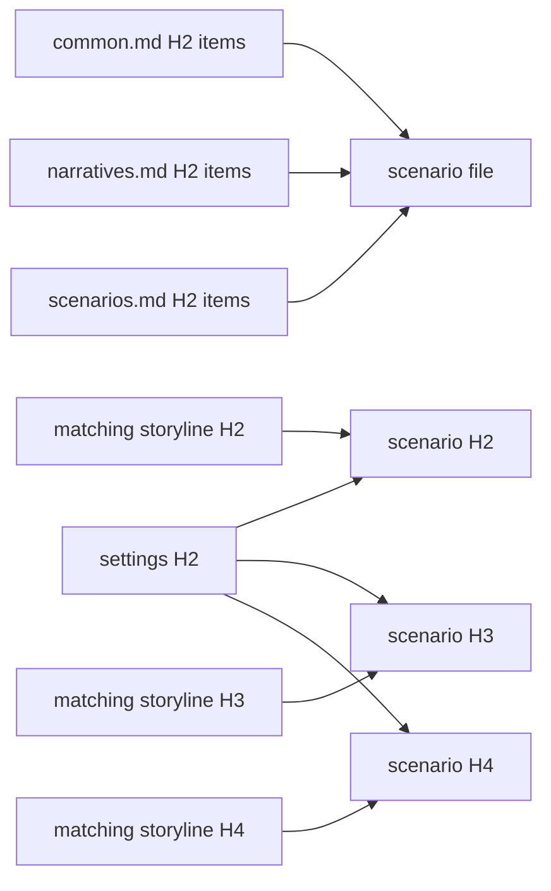

# Scenarios

Mirror the reviewed storyline's ordered files, slugs, H2 sequences, H3 chapters, and H4 scenes in `docs/scenarios`.

Scenarios are **production-capable initial scripts**. They are neither causal summaries nor rigid Hollywood shooting scripts. Use a readable hybrid of short descriptive action blocks, selectively numbered changes, and dialogue blocks. The result must be detailed enough that a director, stage maker, game writer, or novelist can adapt it without inventing the scene's essential order, confrontation, or exit.

## Craft

This document owns what an initial script is and how it is produced; `config/docs/principles/common.md` and `narratives.md` own the shared narrative obligations, and `config/docs/principles/scenarios.md` owns the scene obligations — orientation, physical progression, decisive dialogue, turn and exit, environmental pressure, and the stageability test that decides whether a draft is still a storyline. Read all three before drafting and test every H4 against their items. When a scenario unit reads no more concretely than the storyline unit it refines, it has been restated rather than staged: find the positions, objects, exchanges, and timings the storyline left to this layer.

## Evidence



Answer the `principles/common.md`, `principles/narratives.md`, and `principles/scenarios.md` checklists in one HTML comment before the file's first H1. Do not repeat principle tags under H2, H3, or H4.

Place setting and cross-layer lineage acknowledgements directly below the H2, H3, or H4 they justify:

```text
<!--
@evidence storylines/001-opening.md#scene-id This script realizes the inherited scene through its actual confrontation, movement, and changed exit condition.
-->
```

- H2 cites the matching storyline H2.
- H3 cites the matching storyline H3.
- H4 cites the matching storyline H4.
- Every unit cites the settings it actually uses and stays silent about the rest; a setting no host in the population uses takes one concrete population-wide `@evidenceExclude`.

Markdown hierarchy already determines each scenario H3's H2 parent and each H4's H3 parent. Do not duplicate that same-layer parentage with evidence tags.

Targets are relative to their configured reference root, not to the scenario file. Use `settings/...`, `storylines/...`, or `principles/...` without a `docs/` prefix. Write the reason with the actual inherited fact, causal duty, or execution choice.

Load `$evidence-graph` [staging](../evidence-graph/staging.md) before changing state. Its main skill owns tag grammar, checklist policy, roots, coverage, and exclusions; follow its [review procedure](../evidence-graph/review.md) only in `review`.

## Harness

Control this layer in the package `lint.config.ts`:

```ts
scenarios: "disabled",
```

1. Start only after the matching storyline has a clean review build.
2. Keep `disabled` while writing the complete initial script without compiler pressure.
3. Read every H4 aloud or enact its order mentally. Test physical possibility, knowledge, motive, timing, resources, speech, silence, staging, and earned cuts.
4. Change to `evidence`; resolve graph diagnostics and repair any owning upstream layer.
5. Change to `review` only after the evidence build is clean.
6. Reach a clean review build before starting manuscripts.

When detail exposes a setting or storyline defect, fix the earliest layer and reread the full path back to the scene.
