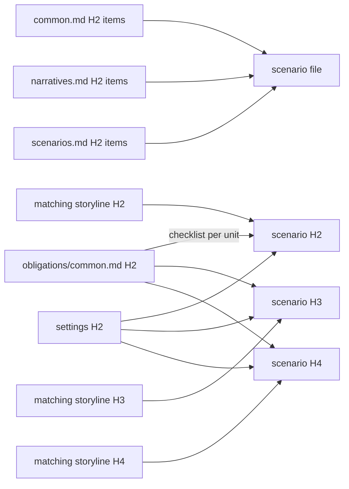

# Scenarios

Mirror the reviewed storyline's ordered files, slugs, H2 sequences, H3 chapters, and H4 scenes in `docs/scenarios`.

Scenarios are **production-capable initial scripts**. They are neither causal summaries nor rigid Hollywood shooting scripts. The result must be detailed enough that a director, stage maker, game writer, or novelist can adapt it without inventing the scene's essential order, interaction or process, and exit.

## Craft

This document owns what an initial script is and how it is produced; `config/docs/principles/common.md` and `config/docs/principles/narratives.md` own the shared checklists, `config/docs/principles/scenarios.md` owns the scenario checklist, and `config/docs/obligations/common.md` owns the common duties every H2/H3/H4 must prove. Read all four before drafting and test every unit against their items; do not restate them here. When a scenario unit reads no more concretely than the storyline unit it refines, it has been restated rather than staged: find the positions, objects, exchanges, and timings the storyline left to this layer.

For every H4, enact and record its exact temporal and spatial conditions; when the work deliberately replaces ordinary time or place, specify the rule that does so. Record participants or active forces, focal access or observation range, entry conditions, immediate objective or organizing activity, any obstruction, consequential actions, reactions, or process changes, spatial or informational movement, decisive exchange or turn, any applicable knowledge change, and exit state. Write every exchange whose wording, tactic, lie, refusal, interruption, or silence changes choice, knowledge, power, or relationship, together with the action and response around it; summarize only incidental speech that changes none of them. A summary that merely says these things occur fails the common substantive-completion obligation.

Before drafting, copy the reviewed storyline unit map and verify that every scenario H4 inherits exactly one scene identity. Apply `config/docs/principles/narratives.md#unit-addressability` and return any necessary split or merge to the storyline first. Apply `config/docs/principles/scenarios.md#script-blocks` while drafting; number a progression only when its order would otherwise be ambiguous. Afterward, reverse-outline the action and dialogue blocks and reject both scene-wide prose slabs and fragments that break an otherwise continuous action.

## Evidence



This layer answers `principles/common.md`, `principles/narratives.md`, and `principles/scenarios.md`. Every H2, H3, and H4 directly answers every `obligations/common.md` item and may exclude none. Each unit cites the settings it uses and exactly one matching storyline unit at the same level, plus any additional relationship whose package claim selects that unit:

```text
<!--
@evidence storylines/001-opening.md#scene-id This script realizes the inherited scene through its staged progression and specified exit effect.
-->
```

Write the reason with the actual inherited fact, narrative duty, or execution choice.

## Harness

```ts
scenarios: "disabled",
```

Before leaving `disabled`, enact every H4 in order: test physical possibility, timing, resources, staging, earned cuts, proportional expansion beyond its storyline parent, and any applicable knowledge, motive, speech, or silence. Audit the completed hierarchy for a hidden independent scene and repair its storyline parent before splitting or merging lineage. A failed common obligation keeps the complete scenario layer in `disabled` until repaired.

When detail exposes a setting or storyline defect, fix the earliest layer and reread the full path back to the scene.
