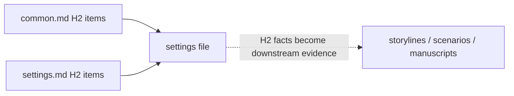

# Settings

Keep canon in `<work-package>/docs/settings`. Use Markdown only, ordered filenames, and one stable anchored H2 per addressable fact.

## Craft

`config/docs/principles/common.md` and `config/docs/principles/settings.md` own what canon must contain and how it is declared, kept coherent, kept execution-neutral, researched, and checked. Read both before writing and draft every file against their items; do not restate them here or in package documents.

## Research

Run the research; do not write canon from recall. Search and browse for every claim that can change a setting or a scene — current, disputed, niche, legal, medical, scientific, historical, and cultural — and open the primary document, official record, scholarly edition, archive, or specialist institution before accepting any secondary summary.

Record each externally checkable fact with the source that supports it, and record disagreement between sources rather than picking the tidier one. A claim written from memory is a defect even when it happens to be true; the evidence graph checks structure, never external truth.

## Fact form

`principles/settings.md` requires every fact to carry its standing; this document fixes where that standing appears, so a downstream citation inherits it instead of guessing. Open each H2 with the marker and keep one marker set across every settings file in a package — a standing stated explicitly in one file and dissolved into prose in the next cannot be read from a citation.

Close each H2 with the sources supporting its externally checkable claims.

## Revise upstream

Settings are authoritative, not frozen. When later work finds a contradiction, omission, implausible constraint, or stronger choice:

1. change the setting first;
2. find every citation and factual occurrence downstream;
3. reread affected units and adjacent consequences;
4. repair descendants;
5. renew stale reviews.

Do not rewrite canon merely to excuse a downstream mistake. Compare research, dramatic purpose, and total consequences.

## Evidence



Settings files answer `principles/common.md` and `principles/settings.md` and cite nothing else — their H2 facts are the evidence downstream layers consume.

`$evidence-graph` owns tag grammar, roots, coverage, and exclusions. Load its [staging](../evidence-graph/staging.md) before changing state and its [review procedure](../evidence-graph/review.md) for fingerprints.

## Harness

Control this layer in the package `lint.config.ts`:

```ts
settings: "disabled",
```

Before leaving `disabled`, read the complete setting system for contradictions, impossible timelines, undefined exceptions, unsupported precision, predetermined arcs, and inert detail.

Later layers keep revising settings when they expose a defect; each revision expires the affected reviews, and renewing them is part of the revision.
