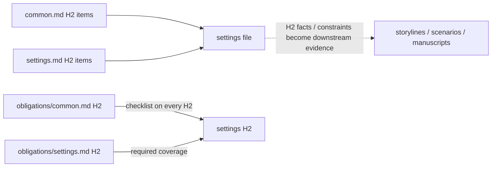

# Settings

Keep canon in `<work-package>/docs/settings`. Use Markdown only and ordered filenames. Apply `config/docs/principles/settings.md#addressable-canon` to every settings file.

The work's delivery scope, promise, reader access, and setting coverage map are settings constraints of their own. Record them in the first settings file before the world facts that serve them.

Before bulk prose, complete the [work-specific contract](work-specific.md) pass. Put work-wide canon here, but route narrative order, per-file craft conditions, distributed layer roles, and other independent evidence behavior to their own package-local targets.

## Topology

A file is a domain namespace; an H2 is the evidence owner. Start with the applicable templates below, then split, rename, or add ordered files wherever the work's scale requires it:

| Starter file | Domain |
| --- | --- |
| `001-foundation.md` | delivery contract, reality baseline, and coverage map |
| `010-world-laws.md` | cosmology, world laws, and ontological departures |
| `020-time-and-history.md` | time, chronology, and history before or outside narrated events |
| `030-space-and-environment.md` | places, distances, environment, ecology, and hazards |
| `040-agents-and-relationships.md` | agents, species, kinship, and individual relationships |
| `050-institutions-and-power.md` | groups, institutions, offices, law, power, and enforcement |
| `060-society-and-culture.md` | society, culture, language, belief, education, and custom |
| `070-material-life-and-economy.md` | material life, resources, economy, logistics, and infrastructure |
| `080-knowledge-and-capabilities.md` | knowledge, technology, artifacts, capabilities, costs, and limits |
| `090-system-interfaces.md` | cross-system dependencies, pressures, and the opening world state |
| `100-sources-and-uncertainty.md` | independent source conflicts, interpretations, canon decisions, and uncertainty |

Audit every domain, but create no empty or irrelevant file. Mark an unused domain in the coverage map as inherited from the primary world, outside the delivery scope, or unresolved. A central owner may take its own file, and a dense domain may span as many ordered files as needed. The starter numbers establish initial order, not reserved ranges; renumber later entries when expansion requires it.

`100-sources-and-uncertainty.md` is not a duplicate bibliography. Put direct support for a claim in that claim's owning H2. Use this domain only when a source conflict, interpretation, canon decision, or unresolved question is itself an independent downstream fact with its own consumers and review path.

## H2 decomposition

`config/docs/principles/settings.md#addressable-canon` owns the pass condition. Before drafting a file, inventory its candidate owners and separate any element with its own consumer, factual standing, change path, or review. After drafting, audit headings, overview prose, lists, tables, and embedded biographies for hidden owners; split every bundle and repair affected references before the file can answer that principle.

For each resulting owner, settle the applicable boundary, status, operating conditions, authority or access, resources, dependencies, costs, limits, exceptions, present state, and downstream consequences. These are completion questions, not mandatory field labels.

Draft each H2 through `config/docs/principles/settings.md#information-structure`. Afterward, reverse-outline its paragraphs with one short function label each. Split a paragraph that carries independently reviewable functions, merge fragments that cannot stand as a coherent step, and remove any orientation sentence that merely repeats the detailed body.

## Craft

`config/docs/principles/common.md` and `config/docs/principles/settings.md` own the file-level questions for declaring, researching, and checking canon while keeping it coherent and execution-neutral. `config/docs/obligations/common.md` owns the common duties every H2 must prove, and `config/docs/obligations/settings.md` owns the roles the full settings population must cover. Read all four before writing; do not restate their tests in package documents.

## Research

Before prose, derive research questions from the delivery scope and every domain in the canon coverage map. Identify which planned H2 decisions depend on external facts, which disputes or missing values could alter a scene, and what direct evidence would settle or bound each question. Research every such claim rather than writing it from recall.

Use search results and collection portals only for discovery, then open direct evidence and apply `config/docs/principles/settings.md#source-support` before accepting a claim. Record the supported conclusion, exact fact status, material qualifier, and retrievable source in the owning H2; keep independent source conflicts and canon decisions in their own H2 only when they meet the addressability test. A remembered fact without this check is defective even when true, and the evidence graph does not verify external truth.

After drafting the complete settings layer, audit every externally checkable precision, every `Contested` or `Unresolved` statement, and every coverage-map domain against the collected research questions. Reopen direct evidence where support is indirect, stale, broader than the claim, or contradicted. If downstream work needs an unresolved answer, research or decide it before leaving `disabled`; do not pass uncertainty forward as an unstated invention task.

## Fact form

`config/docs/principles/settings.md` requires every fact to carry its standing; this document fixes its form so a downstream citation inherits it instead of guessing. After any evidence comment directly below an H2, begin the authored body with `**Status:**` and one or more of `Source-verified`, `Work decision`, `Contested`, or `Unresolved`; add a short qualifier when the label alone would hide scope or uncertainty. Use this form in every settings file.

End an H2 that contains externally checkable claims with a `Sources:` line. A pure work decision needs no invented external source.

## Revise upstream

Settings are authoritative, not frozen. When later work finds a contradiction, omission, implausible constraint, or stronger choice:

1. change the setting first;
2. find every citation and factual occurrence downstream;
3. reread affected units and adjacent consequences;
4. repair descendants;
5. renew stale reviews.

Do not rewrite canon merely to excuse a downstream mistake. Compare research, dramatic purpose, and total consequences.

## Evidence



Settings files answer `principles/common.md` and `principles/settings.md`. Every settings H2 directly answers every `obligations/common.md` item and may exclude none. Each required `obligations/settings.md` role may receive concrete evidence from multiple settings H2s that materially realize it, but the complete settings population must cover every role and may exclude none. A package lint config may add further evidence relationships; follow their selected host scope rather than assuming settings cite nothing else. Settings H2 facts and constraints remain the evidence downstream layers consume.

## Harness

```ts
settings: "disabled",
```

Before leaving `disabled`, read the complete setting system for contradictions, impossible timelines, undefined exceptions, unsupported precision, predetermined arcs, inert detail, silent scope loss, umbrella H2s, and unexplained collapse against the declared or inherited scale. A failed common obligation keeps the whole settings layer in `disabled` until repaired.

Later layers keep revising settings when they expose a defect; each revision expires the affected reviews, and renewing them is part of the revision.
