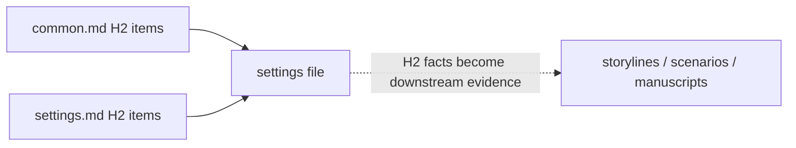

# Settings

Keep canon in `<work-package>/docs/settings`. Use Markdown only, ordered filenames, and one stable anchored H2 per addressable fact.

## Craft

`config/docs/principles/settings.md` owns what canon must contain and how it is declared, kept coherent, kept execution-neutral, researched, and checked. Read it before writing and draft every file against its items; do not restate it here or in package documents.

## Revise upstream

Settings are authoritative, not frozen. When later work finds a contradiction, omission, implausible constraint, or stronger choice:

1. change the setting first;
2. find every citation and factual occurrence downstream;
3. reread affected units and adjacent consequences;
4. repair descendants;
5. renew stale reviews.

Do not rewrite canon merely to excuse a downstream mistake. Compare research, dramatic purpose, and total consequences.

## Evidence



Each settings file answers the `principles/common.md` and `principles/settings.md` checklists in one HTML comment before its first H1. Settings files cite nothing else — their H2 facts are the evidence downstream layers consume. Load `$evidence-graph` [staging](../evidence-graph/staging.md) before changing state; its main skill owns tag grammar, checklist policy, coverage, and exclusions, and its [review procedure](../evidence-graph/review.md) owns fingerprints.

## Harness

Control this layer in the package `lint.config.ts`:

```ts
settings: "disabled",
```

1. Keep `disabled` while researching and writing the complete canon without compiler pressure.
2. Read the complete setting system. Check contradictions, impossible timelines, undefined exceptions, unsupported precision, predetermined arcs, and inert detail.
3. Change to `evidence`; answer both checklists truthfully and repair any file an item exposes.
4. Change to `review` only after the evidence build is clean; fingerprint each item answer while performing its check.
5. Reach a clean review build before activating storylines.

Later layers keep revising settings when they expose a defect; each revision expires the affected reviews, and renewing them is part of the revision.
