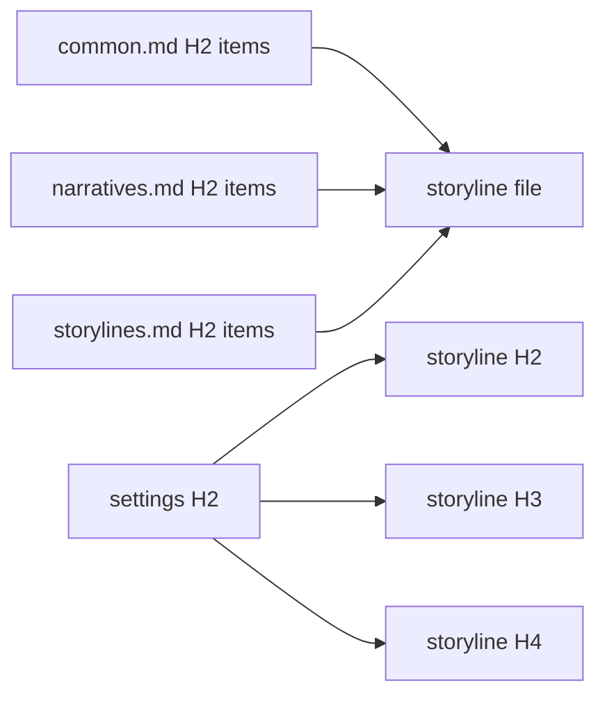

# Storylines

Write `docs/storylines` with ordered filenames and `H2 sequence → H3 chapter → H4 scene`.

## Scope

A storyline is a **detailed narrative treatment**, not a causal card and not a preliminary screenplay. It must let a careful reader understand the work's movement before a scenario or manuscript exists. This document owns what a treatment is; `config/docs/principles/common.md`, `narratives.md`, and `storylines.md` own the craft it must satisfy. Read all three before drafting.

Each H4 writes the actual dramatic development in connected prose. It establishes the inherited pressure or question that makes the reader enter, the people or forces able to act, the material and social conditions that constrain them, the attempt and resistance, the meaningful choice or discovery, and the changed condition that makes a later scene necessary. Name emotions only through their cause, decision, expression, or changed relationship; do not replace action with a label such as “trust deepens.”

H2 and H3 do more than group scenes. They state the sequence or chapter's live question, accumulating pressure, and the altered condition that opens its successor, so the file has a readable long-form current even where scenes cut across time, place, or focal character.

Write enough particularity to make the narrative testable: who knows what, who can refuse, what is physically or institutionally possible, what alternative is genuinely available, and why the chosen action changes later options. Repeated motifs and returning characters must change through use; they are not decorative reminders.

Storylines may contain short quoted speech when its wording, lie, refusal, or silence is a causal hinge. They do **not** contain line-by-line dialogue, blocking notation, actor cues, timing marks, or a beat list that simulates a script. Those belong to scenarios. They are more detailed than an outline because they tell the reader what happens and why it matters; scenarios are more detailed because they tell a maker exactly how the event unfolds in space, time, speech, and bodily response.

Reject and rewrite any H4 that is only a premise, a lore dump, an event ledger, a future promise, or a generic “therefore” handoff. Do not pad with scenery or historical research that has no effect on choice, perception, power, or cost.

## Granularity

Decide before drafting how much narrated time and event one H4 carries, and record that decision beside the work's intended scale. The choice is not free: every scene written here becomes a scene to stage and a scene to realize in the finished work, so the scene count fixes the size of both later layers before either is started.

A count the later layers cannot realize is never solved by thinning every scene toward a report of its own events; that trades a visible shortfall for an invisible one. Change the granularity so a chapter carries fewer and heavier scenes, or change the scope the work claims — and say which one was changed.

## Evidence



This layer answers `principles/common.md`, `principles/narratives.md`, and `principles/storylines.md`. It has no cross-layer parent: storylines are where the settings catalog is first accounted for, so each H2, H3, and H4 cites the settings it uses and nothing else.

`$evidence-graph` owns tag grammar, roots, coverage, and exclusions. Load its [staging](../evidence-graph/staging.md) before changing state and its [review procedure](../evidence-graph/review.md) for fingerprints.

## Harness

Control this layer in the package `lint.config.ts`:

```ts
storylines: "disabled",
```

Before leaving `disabled`, read the entire treatment as a reader: test every scene's arrival, turn, departure, long-range consequence, agency, and the intelligibility of every deliberate jump. Repair the story when a diagnostic exposes misuse, overclaim, missing canon, inert scene function, or a false bridge.

If later work changes causality, revise the smallest true storyline unit first and propagate the change.
