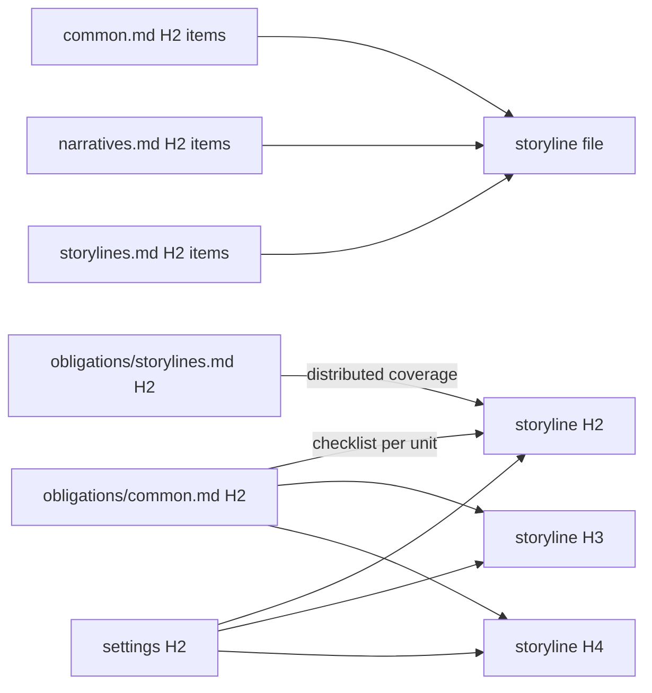

# Storylines

Write `docs/storylines` with ordered filenames and `H2 sequence → H3 chapter → H4 scene`.

## Scope

A storyline is a **detailed narrative treatment**, not a causal card and not a preliminary screenplay. It must let a careful reader understand the work's movement before a scenario or manuscript exists. This document owns what a treatment is; `config/docs/principles/common.md`, `config/docs/principles/narratives.md`, and `config/docs/principles/storylines.md` own the craft it must satisfy, while `config/docs/obligations/common.md` owns the common duties every H2/H3/H4 must prove. Read all four before drafting.

Each H4 writes the actual narrative development in connected prose. It establishes the inherited question or condition, the people or forces present, the material and social constraints, the action, observation, or process that unfolds, any available alternative or resistance, and the choice, discovery, shift, or formal effect that changes what follows. When emotion matters, ground it in cause, decision, expression, or changed relationship; do not replace development with a label such as “trust deepens.”

Write enough particularity to make the narrative testable: where participants exist, who knows what; what is physically or institutionally possible; and how the chosen action, process, or formal progression changes what can follow. Where agency operates, identify who can refuse and which alternatives are genuine. Repeated motifs and returning characters must acquire changed context or effect through use; they are not decorative reminders.

Storylines may contain short quoted speech when its wording, lie, refusal, or silence is a narrative hinge. They do **not** contain line-by-line dialogue, blocking notation, actor cues, timing marks, or a beat list that simulates a script. Those belong to scenarios. They are more detailed than an outline because they tell the reader what happens and why it matters; scenarios are more detailed because they tell a maker exactly how the event unfolds in space, time, speech, and bodily response.

Reject and rewrite any H4 that is only a premise, a lore dump, an event ledger, a future promise, or a generic “therefore” handoff. Do not pad with scenery or historical research that has no effect on action, perception, power, cost, or formal development.

## Granularity

Decide before drafting how much narrated time and event, process, or formal development one H4 carries, using the intended scale already recorded in settings. The choice is not free: every scene written here becomes a scene to stage and realize in the finished work, so the scene count fixes later unit counts and strongly constrains their size before either layer starts.

Make a unit map before prose: give every planned H2, H3, and H4 its sequence key and slug, inherited entry, central progression or formal operation, exit, and relation to its parent. Apply `config/docs/principles/narratives.md#unit-addressability` before accepting the map. After drafting, audit every H2/H3 umbrella and every H4 for a hidden independent progression; repair the map and prose together.

A count or unit size the later layers cannot realize is never solved by thinning scenes toward reports of their own events; that trades a visible shortfall for an invisible one. Redesign the storyline granularity by splitting overloaded scenes, joining fragments without independent function, or changing planned unit size while preserving the declared scale. If that scale itself must change, obtain explicit user approval and revise settings before continuing.

Apply `config/docs/principles/storylines.md#treatment-paragraphs` while drafting. Reverse-outline each unit's direct paragraphs after drafting; one label should identify each paragraph's causal or logical job. Split mixed jobs, join fragments that break the progression, and make H2/H3 direct bodies organize rather than repeat their descendants.

## Evidence



This layer answers `principles/common.md`, `principles/narratives.md`, and `principles/storylines.md`. Every H2, H3, and H4 directly answers every `obligations/common.md` item and may exclude none. It has no narrative-lineage parent: storylines are where the settings catalog is first accounted for, so each H2, H3, and H4 cites the settings it uses. Each required `obligations/storylines.md` role may receive concrete evidence from multiple storyline H2s that materially realize it, but the complete H2 population must cover every role and may exclude none. Every H2 that realizes a role continues it through the matching scenario and manuscript H2 lineage. Follow any further package claims selected by `lint.config.ts`.

## Harness

```ts
storylines: "disabled",
```

Before leaving `disabled`, read the entire treatment as a reader: test every scene's arrival, turn, departure, long-range consequence, applicable agency, the intelligibility of every deliberate jump, and whether the complete structure still realizes the declared work scale. Compare the finished hierarchy to the unit map and reject umbrella units or hidden independent scenes. Repair the story when a diagnostic exposes misuse, overclaim, missing canon, inert scene function, a false bridge, causal-card compression, or a failed common obligation.

If later work changes a narrative connection, event, or effect, revise the smallest true storyline unit first and propagate the change.
