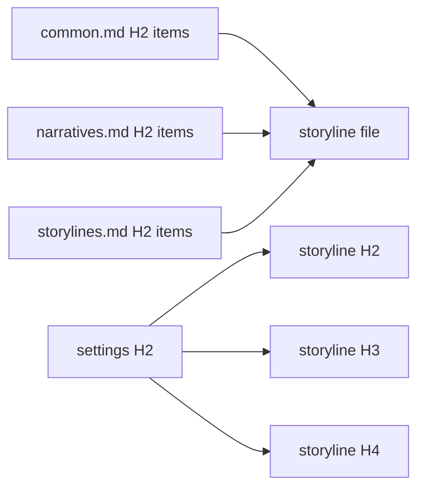

# Storylines

Write `docs/storylines` with ordered filenames and `H2 sequence → H3 chapter → H4 scene`.

## Scope

A storyline is a **detailed narrative treatment**, not a causal card and not a preliminary screenplay. It must let a careful reader understand the novel's movement before a scenario or manuscript exists. This document owns what a treatment is; `config/docs/principles/common.md`, `narratives.md`, and `storylines.md` own the craft it must satisfy. Read all three before drafting.

Each H4 writes the actual dramatic development in connected prose. It establishes the inherited pressure or question that makes the reader enter, the people or forces able to act, the material and social conditions that constrain them, the attempt and resistance, the meaningful choice or discovery, and the changed condition that makes a later scene necessary. Name emotions only through their cause, decision, expression, or changed relationship; do not replace action with a label such as “trust deepens.”

H2 and H3 do more than group scenes. They state the sequence or chapter's live question, accumulating pressure, and the altered condition that opens its successor, so the file has a readable long-form current even where scenes cut across time, place, or focal character.

Write enough particularity to make the narrative testable: who knows what, who can refuse, what is physically or institutionally possible, what alternative is genuinely available, and why the chosen action changes later options. Repeated motifs and returning characters must change through use; they are not decorative reminders.

Storylines may contain short quoted speech when its wording, lie, refusal, or silence is a causal hinge. They do **not** contain line-by-line dialogue, blocking notation, actor cues, timing marks, or a beat list that simulates a script. Those belong to scenarios. They are more detailed than an outline because they tell the reader what happens and why it matters; scenarios are more detailed because they tell a maker exactly how the event unfolds in space, time, speech, and bodily response.

Reject and rewrite any H4 that is only a premise, a lore dump, an event ledger, a future promise, or a generic “therefore” handoff. Do not pad with scenery or historical research that has no effect on choice, perception, power, or cost.

## Granularity

Decide before drafting how much narrated time and event one H4 carries, and record that decision beside the work's intended scale. The choice is not free: every scene written here becomes a scene to stage and a scene to realize as prose, so the scene count fixes the size of both later layers before either is started.

A sequence that spans decades tempts a scene into becoming a chronicle entry — a date, a decision, an outcome, nobody named and nothing handled. When the material genuinely holds that many events, compress at H3 by giving a chapter fewer and heavier scenes, never by thinning every scene toward a ledger line. Splitting a long span across separate works is better than a scene count no later layer can carry.

## Evidence



Answer the `principles/common.md`, `principles/narratives.md`, and `principles/storylines.md` checklists in one HTML comment before the file's first H1. Do not repeat principle tags under H2, H3, or H4.

H2, H3, and H4 cite the settings they actually use and stay silent about the rest; a setting no host in the population uses takes one concrete population-wide `@evidenceExclude`. Markdown hierarchy already determines each H3's H2 parent and each H4's H3 parent, so do not duplicate same-layer parentage with evidence tags. Use `settings/...` and `principles/...` without `docs/`.

Load `$evidence-graph` [staging](../evidence-graph/staging.md) before changing state. Its main skill owns tag grammar, checklist policy, roots, coverage, and exclusions; its [review procedure](../evidence-graph/review.md) owns fingerprints.

## Harness

Control this layer in the package `lint.config.ts`:

```ts
storylines: "disabled",
```

1. Start only after the settings have a clean review build.
2. Keep `disabled` while writing the complete detailed treatment without compiler pressure.
3. Read the entire treatment as a reader. Test every scene's arrival, turn, departure, long-range consequence, agency, and the intelligibility of every deliberate jump.
4. Record an obvious truthful `@evidence` when useful, but do not interrupt drafting to complete coverage.
5. Change to `evidence`; resolve principle checklist and H2/H3/H4 setting diagnostics truthfully.
6. Repair the story when a diagnostic exposes misuse, overclaim, missing canon, inert scene function, or a false bridge.
7. Change to `review` only after the evidence build is clean.
8. Independently reread both ends of every acknowledgement and reach a clean review build before starting scenarios.

If later work changes causality, revise the smallest true storyline unit first and propagate the change.
